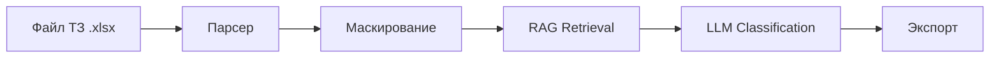

# clarify-engine-ai

**AI-powered tool for automated analysis of tender requirements (TZ) using RAG architecture.**

[](docs/CONCEPT.md#811-mvp)
[](https://www.python.org/downloads/)
[](LICENSE)

Open-source модуль для работы с требованиями и базой знаний. Классифицирует требования в категории `Да` / `Нет` / `Частично` / `НД` с обязательным цитированием документации (RAG).

> 📌 **Владелец проекта:** [Ivan Gulienko](https://github.com/G-Ivan-A) (независимая разработка).
> 🏢 **Назначение:** анализ соответствия тендерных ТЗ функциональности целевой платформы.
> 🗂️ **Единый источник истины (SSoT):** [`docs/CONCEPT.md`](docs/CONCEPT.md).

---

## 📚 Table of Contents
1. [Обзор](#-обзор)
2. [Ключевые возможности](#-ключевые-возможности)
3. [Архитектура и Roadmap](#-архитектура-и-roadmap)
4. [Быстрый старт](#-быстрый-старт)
5. [Конфигурация и Безопасность](#-конфигурация-и-безопасность)
6. [Структура репозитория](#-структура-репозитория)
7. [Документация проекта](#-документация-проекта)
8. [Команда проекта](#-команда-проекта)
9. [Качество и метрики](#-качество-и-метрики)
10. [Лицензия](#️-лицензия)

---

## 🔍 Обзор
Решение проблемы ручного скрининга ТЗ через RAG-паттерн:
- **Гибридный поиск:** BM25 + Dense (BGE-M3) + RRF для высокой точности.
- **Безопасность данных:** маскирование чувствительных данных перед отправкой в LLM.
- **Аудируемость:** каждый запуск логируется с уникальным `RunID`.
- **Human-in-the-Loop:** финальное утверждение остаётся за бизнес-аналитиком.

---

## ✨ Ключевые возможности

| Возможность | Описание |
|-------------|----------|
| 📥 **Парсинг** | Извлечение требований из `.xlsx` (конфигурируемые колонки). |
| 🔎 **RAG-Поиск** | Гибридный поиск по внутренней базе знаний (ChromaDB). |
| 🤖 **LLM-Классификация** | Fallback-цепочка (Qwen → DeepSeek → GigaChat → YandexGPT). |
| 🛡️ **Маскирование** | Regex-замена PII (email, phone, IP, domain) до отправки запроса. |
| 📤 **Экспорт** | Возврат файла с колонками `[Статус]`, `[Комментарий]`, `[Confidence]`, `[RunID]`. |
| 🖥️ **Streamlit UI** | Веб-интерфейс для загрузки файлов и мониторинга прогресса. |
| 📊 **Quality Gate** | CLI-скрипт для замера Macro-F1 на эталонных данных. |

---

## 🏗️ Архитектура и Roadmap

### Текущая архитектура (MVP)
Монолитный Python-пайплайн, работающий локально или в изолированной облачной среде.



### Дорожная карта (Roadmap)
- ✅ **MVP (Done):** end-to-end пайплайн, Streamlit UI, замер Macro-F1.
- 🚧 **Pilot (In Progress):**
  - переход к микросервисной архитектуре;
  - оркестрация ИИ-агентов и сервисов (n8n / LangGraph);
  - изоляция базы знаний: доступ к внутренним данным целевой платформы через защищённые API-шлюзы.
- 📅 **Production:** масштабирование до 200 пользователей, GPU-ускорение эмбеддингов.

Подробности — в [`docs/CONCEPT.md`](docs/CONCEPT.md) §8 и [`docs/ADR/`](docs/ADR/).

---

## 🚀 Быстрый старт

### 1. Установка зависимостей
```bash
git clone https://github.com/G-Ivan-A/clarify-engine-ai.git
cd clarify-engine-ai

python -m venv venv
source venv/bin/activate  # Windows: venv\Scripts\activate

pip install --no-cache-dir -r requirements.txt
# Для CPU-сред:
pip install --no-cache-dir torch --index-url https://download.pytorch.org/whl/cpu
```

### 2. Настройка окружения
Создайте файл `.env` в корне (не коммитьте его!):
```env
DASHSCOPE_API_KEY=sk-...  # Для тестового режима (Qwen)
# Для Production используйте только RU-резидентные ключи
```

### 3. Запуск
```bash
# Индексация базы знаний (один раз)
python knowledge_base/indexing/build_index.py

# Запуск интерфейса
streamlit run src/app.py
```

---

## ⚙️ Конфигурация и Безопасность

Все параметры вынесены в каталог [`configs/`](configs/):
- [`llm_config.yaml`](configs/llm_config.yaml) — управление провайдерами и fallback-цепочкой.
- [`embedding_config.yaml`](configs/embedding_config.yaml) — параметры чанкинга и модели BGE-M3.
- [`masking_rules.yaml`](configs/masking_rules.yaml) — regex-паттерны для защиты данных.
- [`classification_rules.json`](configs/classification_rules.json) — детерминированные правила классификации.
- [`parsing_config.yaml`](configs/parsing_config.yaml) — настройки парсинга `.xlsx`.

⚠️ **Политика данных:**
- Проект разрабатывается независимо.
- В режиме `use_test_data_mode: true` допускается использование зарубежных LLM (данные маскируются).
- В Production используются только резидентные провайдеры (GigaChat, YandexGPT).
- Доступ к корпоративной БЗ в фазе **Pilot** будет реализован через изолированные микросервисы.

Полная политика — в [`SECURITY.md`](SECURITY.md).

---

## 📁 Структура репозитория

| Каталог | Назначение |
|---------|------------|
| [`src/`](src/) | Исходный код пайплайна ([`app.py`](src/app.py), [`pipeline.py`](src/pipeline.py), `rag/`, `llm/`). |
| [`configs/`](configs/) | YAML/JSON конфигурации (без хардкода). |
| [`prompts/`](prompts/) | Системные промпты и few-shot примеры (версионируемые). |
| [`knowledge_base/`](knowledge_base/) | Источники данных и скрипты индексации (ChromaDB). |
| [`scripts/`](scripts/) | Утилиты оценки качества и генерации данных ([`evaluate_quality.py`](scripts/evaluate/evaluate_quality.py)). |
| [`docs/`](docs/) | Документация: концепция, ADR, аудиты, стандарты. |
| [`tests/`](tests/) | Юнит- и интеграционные тесты. |

---

## 📖 Документация проекта

Для глубокого погружения используйте навигацию по артефактам:

| Документ | Описание |
|----------|----------|
| 📘 [Концепция (SSoT)](docs/CONCEPT.md) | Бизнес-контекст, требования, риски, план внедрения. |
| 🏛️ [Архитектурные решения (ADR)](docs/ADR/) | Обоснование выбора RAG, гибридного поиска, BGE-M3. |
| 📐 [Стандарты](docs/standards/) | [Роли команды](docs/standards/roles.md), [конвенция именования](docs/standards/naming-convention.md), [модель эмбеддингов](docs/standards/embedding-model.md). |
| 🔍 [Аудиты](docs/audit/) | Отчёты о безопасности, [маскировании](docs/audit/data-masking_v1.md), покрытии кода. |
| 📝 [Аналитические отчёты](docs/analysis/) | Ревью концепции, код-аудиты, рекомендации команды. |
| 📚 [Runbooks](docs/runbooks/) | Эксплуатационные инструкции (наполнение с этапа «Пилот»). |
| 🤝 [Contributing](CONTRIBUTING.md) | Definition of Done, правила ветвления, матрица команд. |
| 🔐 [Security](SECURITY.md) | Политика обработки утечек, SLA, контакты. |
| 🗒️ [Changelog](CHANGELOG.md) | История изменений (Keep a Changelog + SemVer). |

---

## 👥 Команда проекта

| Роль | Имя | GitHub | Ответственность |
|------|-----|--------|-----------------|
| **Product Owner** | Ivan Gulienko | [@G-Ivan-A](https://github.com/G-Ivan-A) | Стратегия, концепция, приёмка MVP, коммит PR. |
| **Code Agent** | Konstantin Diachenko | [@konard](https://github.com/konard) | Генерация кода по Issues. |
| **Prompt Owner** | Ivan Gulienko | [@G-Ivan-A](https://github.com/G-Ivan-A) | Промпты, валидация качества. |

Полные обязанности и матрица ответственности — в [`docs/standards/roles.md`](docs/standards/roles.md).

---

## 📏 Качество и метрики

Для подтверждения **NFR-01** (Macro-F1 ≥ 0.70 на gold-standard) используется CLI-скрипт [`scripts/evaluate/evaluate_quality.py`](scripts/evaluate/evaluate_quality.py). Скрипт сопоставляет предсказания пайплайна с эталоном из [`test_data/gold_standard.json`](test_data/gold_standard.json) и рассчитывает Macro-F1 и per-class precision / recall / F1.

```bash
# 1. Запустить пайплайн и получить файл предсказаний (Excel)
python -m src.pipeline \
    --input test_data/sample_tz.xlsx \
    --output output/result_test.xlsx

# 2. Замерить качество относительно эталона
python scripts/evaluate/evaluate_quality.py \
    --gold test_data/gold_standard.json \
    --pred output/result_test.xlsx \
    --output reports/quality_report.json
```

Поддерживаются как Excel-выгрузка пайплайна (колонки `ID` и `[Статус]`), так и JSON-формат `[{"id": ..., "Статус": "Да"}]`. См. целевой показатель и Exit Criteria MVP в [`docs/CONCEPT.md`](docs/CONCEPT.md) §5 и §8.1.1.

---

## ⚖️ Лицензия

Copyright © 2026 Ivan Gulienko.

Проект распространяется под лицензией **MIT License**. Это означает:
1. ✅ Вы можете использовать, копировать, изменять и распространять ПО.
2. ✅ Вы можете использовать его в коммерческих целях.
3. ⚠️ **Обязательное условие:** при распространении кода или производных работ необходимо сохранить уведомление об авторских правах (Attribution).

Полный текст лицензии — в файле [`LICENSE`](LICENSE).
