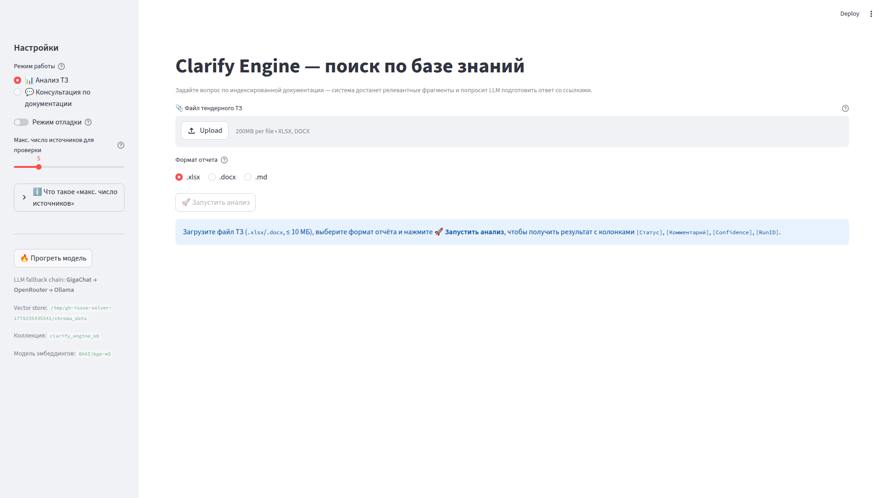
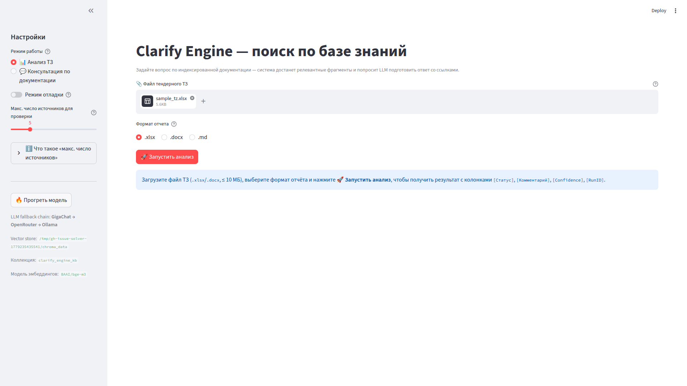
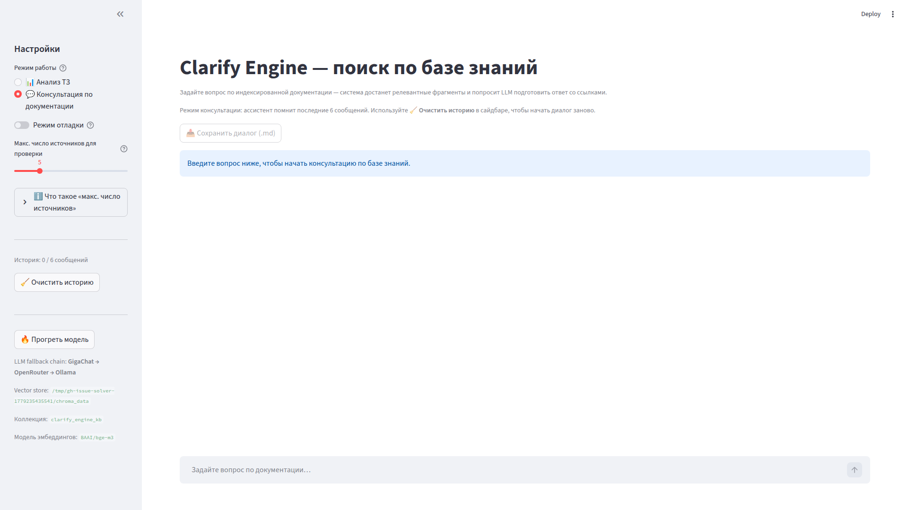

# BL-57 Comprehensive Verification — UI / Code / Docs Alignment Before Pilot

## Метаданные
- **Дата:** 2026-05-20
- **Версия отчета:** v1.0
- **Аудитор:** OpenAI Codex
- **Снепшот кода:** `e9c07aed241e497cb1b960a67d08ee385ef65144`
- **Ветка:** `issue-206-d278c4994e8e`
- **Связанная задача:** [Issue #206](https://github.com/G-Ivan-A/clarify-engine-ai/issues/206)
- **Связанный PR:** [PR #207](https://github.com/G-Ivan-A/clarify-engine-ai/pull/207)
- **Follow-up для P1:** [Issue #208](https://github.com/G-Ivan-A/clarify-engine-ai/issues/208)
- **Режим работ:** audit-only. Код, конфиги, промпты и runbook не менялись; добавлены только этот отчет и UI-скриншоты.
- **SSoT:** `docs/CONCEPT.md` фактически находится на **v2.6** от 2026-05-19. Issue #206 ссылается на v2.5, поэтому аудит использует текущую v2.6 и отмечает остаточные v2.5-ссылки как doc drift.

## Executive Summary

Pilot sign-off **не рекомендуется до закрытия P1 follow-up #208**.

Проверка подтвердила, что core pipeline, parser/export contracts, strict RAG gate, masking, fallback-chain конфиги и live CLI smoke на `test_data/sample_tz.xlsx` работают. При этом активный Streamlit entrypoint `streamlit run src/ui/app.py` расходится с FR-07 / user guide по batch UX, а локальный полный pytest-гейт сейчас красный из-за runbook contract test.

| Severity | Count | Summary |
|---|---:|---|
| P0 | 0 | Критических source-modification / secret-leak / pipeline-crash нарушений не найдено. |
| P1 | 4 | Upload logging crash under INFO, missing active-UI progress/counter, missing active-UI retry-only-errors UX, failing runbook test. |
| P2 | 4 | Output-mode/default-format/doc-version/sidebar-status documentation and UI drift. |

## Verification Commands

| Command | Result | Notes |
|---|---|---|
| `python -m compileall -q src tests` | ✅ pass | Syntax/import bytecode check. |
| `python -m pytest tests/ -q` | ❌ `431 passed, 1 failed` | Fails `test_runbook_section_2_warns_about_env_yaml_cache`. Log: `/tmp/bl57_audit/full_pytest.log`. |
| Targeted UI/pipeline/export/parser/masking/runbook subset | ❌ `190 passed, 2 failed` | Adds order-dependent upload logging failure when INFO logging is enabled. Log: `/tmp/bl57_audit/targeted_pytest.log`. |
| Direct upload logging repro with root INFO | ❌ fails | `KeyError: "Attempt to overwrite 'filename' in LogRecord"`. Log: `/tmp/bl57_audit/upload_validate_info_level.log`. |
| Live CLI smoke | ✅ pass | `USE_TEST_DATA_MODE=true python -m src.pipeline --input test_data/sample_tz.xlsx --output /tmp/bl57_audit/e2e_output/ -v`. |
| Playwright UI smoke | ✅ pass for render/upload-ready | Analysis and Consultation modes rendered; `sample_tz.xlsx` upload enabled the run button. Full live LLM click was not executed because provider availability is environment-dependent. |

Live CLI result:

```text
run_id=4e61b02fc4cf478089207786373e49a3 обработано: 5, успешно: 5, ошибки: 0, НД: 5
```

Generated report:

```text
/tmp/bl57_audit/e2e_output/sample_tz_report_4e61b02f.xlsx
headers: ID, Требование заказчика, Ожидаемый статус, Комментарий эксперта (эталон), [Статус], [Комментарий], [Confidence], [RunID]
rows: 5
statuses: НД x5
run_ids: 4e61b02fc4cf478089207786373e49a3
```

## UI Evidence

### Analysis Mode



Observed:
- Sidebar mode radio is present.
- Analysis upload area is visible in the default `ui.analysis_query_mode: false` path.
- Format radio is visible.
- Run button is disabled until a file is uploaded.
- Sidebar shows fallback chain, vector store, collection and embedding model.

### Analysis Mode With `sample_tz.xlsx` Uploaded



Observed:
- `test_data/sample_tz.xlsx` can be uploaded in the live browser session.
- Run button becomes enabled.
- No batch progress bar, live success/error counter, output-mode caption, or retry-only-errors control is visible before execution.

### Consultation Mode



Observed:
- Mode switch to `💬 Консультация по документации` works.
- History counter and clear-history button are visible only in Consultation mode.
- Chat input and disabled empty-history dialog export button are visible.

## FR / Invariant Matrix

| Area | Status | Evidence |
|---|---|---|
| FR-01 parsing `.xlsx` / `.docx` with locators | ✅ aligned | Dispatcher routes `.xlsx/.xls` and `.docx`; tests cover multi-sheet xlsx and docx paragraph/table locators. |
| FR-02 indexing/chunk config | ✅ aligned | `BAAI/bge-m3`, `chunk_size=512`, `chunk_overlap=64`, strict embedder enabled in `configs/embedding_config.yaml`. Live smoke used BGE-M3 and strict mode. |
| FR-03 hybrid RAG search | ✅ aligned | BM25 + dense + RRF implementation and tests; `top_k=5`, `rrf_k=60`, parent context disabled by default in config. |
| FR-04 LLM classification | ✅ aligned with smoke caveat | Decoding lock is configured; fallback chains are config-driven. Live smoke skipped external LLM calls because KB context was empty and strict mode returned `НД`, which is expected. |
| FR-05 masking | ✅ aligned | `masking_rules.yaml` is the central source; masking tests pass in the focused subset. |
| FR-06 export | ✅ aligned | `ExportRouter` supports `xlsx/docx/md`, rejects `append_to_original` by default, report name template is `{basename}_report_{run_id_8}.{ext}`. Live xlsx report had required MVP columns and one shared run_id. |
| FR-07 Streamlit UI | ⚠️ P1/P2 drift | Default upload flow renders, but active `src/ui/app.py` lacks required progress/counter, retry-only-errors UX, and output-mode selector/caption in the upload path. |
| FR-08 audit trail | ✅ aligned | Live smoke emitted `PIPELINE_START`, per-row strict-mode LLM run IDs, and `PIPELINE_END`; export `[RunID]` matched pipeline run_id. |
| Pre-deploy zero source modification | ✅ aligned | Live output was written to a separate report file; source input was not modified. |
| Production append disabled | ✅ aligned | `configs/export_config.yaml: export.append_mode: false`; `ExportRouter` raises on `append_to_original`. |
| DeepSeek deprecated / fallback reality | ✅ aligned | Active batch chain is `gigachat -> openrouter -> ollama`; active chat chain is `gigachat -> ollama`. |

## Discrepancies

### P1

| ID | Finding | Evidence | Impact | Follow-up |
|---|---|---|---|---|
| BL57-P1-01 | Accepted-file upload logging can crash when INFO logging is enabled. | `src/ui/components/analysis_uploader.py` logs `extra={"filename": ...}`; Python logging reserves `filename`. Direct repro with root INFO fails with `KeyError: "Attempt to overwrite 'filename' in LogRecord"`. | Valid uploads can fail in environments that enable INFO root logging, including tests or future UI logging setup. | [#208](https://github.com/G-Ivan-A/clarify-engine-ai/issues/208) |
| BL57-P1-02 | Active upload flow lacks required progress bar and live `Успешно: X / Ошибки: Y` counter. | `docs/CONCEPT.md` FR-07 requires progress/counter; `docs/user_guide/02_interface_elements.md` says they appear during analysis. Active `src/ui/app.py` upload path uses only `st.spinner(...)`; `st.progress` exists only in legacy `src/app.py`. | BA cannot observe per-row progress during long CPU-only runs; FR-07 acceptance is not met in the active entrypoint. | [#208](https://github.com/G-Ivan-A/clarify-engine-ai/issues/208) |
| BL57-P1-03 | Active upload flow lacks batch `🔁 Повторить только ошибки`. | FR-07 / NFR-08 require retry-only-errors; user guide troubleshooting instructs users to click it. Search shows the control in legacy `src/app.py`, not in active `src/ui/app.py`. | Failed rows cannot be retried from the pilot UI without rerunning the full file or switching to legacy app. | [#208](https://github.com/G-Ivan-A/clarify-engine-ai/issues/208) |
| BL57-P1-04 | Full pytest gate is red. | `python -m pytest tests/ -q` => `431 passed, 1 failed`; failing test: `tests/test_arm_deployment_runbook.py::test_runbook_section_2_warns_about_env_yaml_cache`. BL-53 warning is present in runbook §6, while the test requires it in §2. | PR cannot be considered green for pilot readiness until either runbook §2 or the test is reconciled. | [#208](https://github.com/G-Ivan-A/clarify-engine-ai/issues/208) |

### P2

| ID | Finding | Evidence | Impact |
|---|---|---|---|
| BL57-P2-01 | `output_mode` is not visible in active upload flow. | FR-07 expects format and mode selectors; user guide says `Режим сохранения: create_new` appears under the format selector. In `src/ui/app.py`, the caption is rendered only in the legacy query export path, not `_run_analysis_upload_mode`. | Low functional risk because production append is correctly disabled, but UI/docs are not aligned. |
| BL57-P2-02 | User guide says default export format matches the uploaded file extension. | `docs/user_guide/02_interface_elements.md` says `.docx -> .docx`; active code initializes from `configs/export_config.yaml: default_format: xlsx` and does not infer extension in upload mode. | BA expectation mismatch for `.docx` uploads. |
| BL57-P2-03 | Residual `CONCEPT v2.5` references remain after v2.6. | `docs/CONCEPT.md` header is v2.6, but exit criteria still mention `CONCEPT v2.5`; issue #206 also references v2.5. | Minor SSoT/version drift in audit checklists. |
| BL57-P2-04 | Sidebar does not show the exact issue checklist statuses `UI OK`, `Config loaded`, `Concept available`. | Live sidebar shows useful operational status (`LLM fallback chain`, vector store, collection, embedding model), but not those exact three labels. | Minor checklist/copy mismatch; no functional loss observed. |

## Documentation Alignment Notes

Aligned:
- Runbook uses `streamlit run src/ui/app.py` as the active UI command.
- User guide documents `.xlsx/.docx` upload, 10 MB limit, `.doc` out-of-scope conversion, format selector, and one-button report download.
- Troubleshooting covers provider timeouts, `.env`, Ollama, and cached config restart guidance.
- Export standard and router align on separate report files and no source modification.

Drift:
- `docs/user_guide/02_interface_elements.md` describes progress/counter behavior that is not present in active `src/ui/app.py`.
- Troubleshooting says to use `Повторить только ошибки`, but active `src/ui/app.py` does not expose that batch control.
- Runbook BL-53 cache warning is present in §6 and troubleshooting table, but automated test requires it in §2.
- `docs/CONCEPT.md` mixes current v2.6 header with v2.5 wording in one exit criterion.

## Windows Runbook Smoke

Not executed on a real Windows ARM machine in this Linux/UTC workspace.

Performed instead:
- Static runbook inspection.
- Automated runbook test execution via pytest.
- Live Linux Streamlit smoke for `src/ui/app.py`.
- Live Linux CLI smoke for `python -m src.pipeline --input test_data/sample_tz.xlsx`.

Result:
- The core smoke commands and UI path are documented and mostly executable.
- The current automated runbook contract is red because BL-53 guidance is not in §2 where the test expects it.

## Decision

BL-57 audit is complete. The system has no observed P0 breakage, and the core pipeline/export stack passed live smoke. However, P1 discrepancies mean the current snapshot should be treated as **conditional / not ready for Pilot sign-off** until follow-up [#208](https://github.com/G-Ivan-A/clarify-engine-ai/issues/208) is closed and `python -m pytest tests/ -q` is green.
