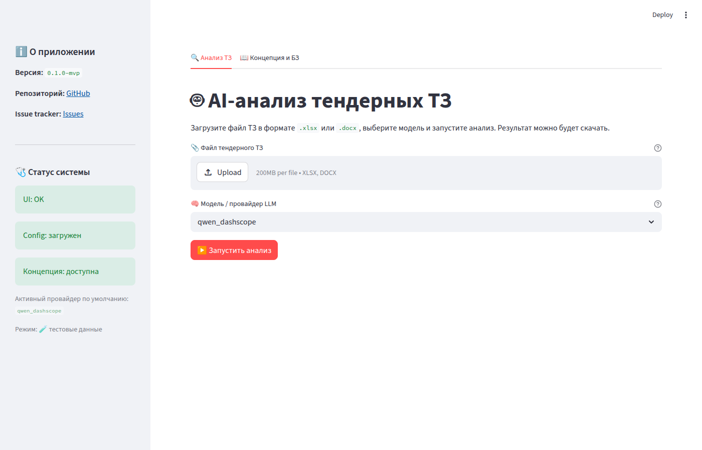

# 1. Режимы работы

> 📘 **Справка для БА** · файл 1 из 4
> Далее → [2. Кнопки и селекторы](02_interface_elements.md)

Система Clarify Engine работает в **двух режимах**. Каждый режим решает свою
задачу и переключается в **левой панели (сайдбаре)** через радио-кнопки
«Режим работы». Выберите режим, который соответствует вашей задаче — и
**только потом** загружайте файлы или задавайте вопросы.

---

## 📊 Анализ ТЗ — для массовой проверки требований

**Когда выбирать.** Вы получили техническое задание (ТЗ) от заказчика в виде
файла `.xlsx` или `.docx`, и вам нужно проверить **все требования сразу** —
найти, какие функции уже описаны в нашей базе знаний, какие нет, и где
требуется уточнение.

**Как работает.**

1. Загружаете файл ТЗ.
2. Выбираете формат отчёта (`.xlsx`, `.docx` или `.md`).
3. Нажимаете «Запустить анализ».
4. Получаете готовый отчёт с колонками **Ref**, **Исходное требование**,
   **Статус**, **Комментарий**, **Confidence** — и скачиваете его одной кнопкой.

**Важная особенность.** Этот режим **не помнит** ваших предыдущих запросов
и файлов. Каждый запуск — это независимая проверка с чистого листа. Так
сделано специально: при анализе сотен требований подмешивание прошлой
переписки сильно удорожает каждый запрос и может «зашумить» результат.

> 💡 **Когда выбирать «Анализ ТЗ»:** «У меня есть файл и его нужно прогнать».

---

## 💬 Консультация — для диалога с базой знаний

**Когда выбирать.** Вам нужно **уточнить деталь** одной конкретной функции,
задать follow-up вопрос, посоветоваться по формулировке требования или просто
быстро понять, что система знает по теме.

**Как работает.**

1. Печатаете вопрос в поле чата внизу страницы.
2. Получаете ответ со ссылками на источники из базы знаний.
3. Задаёте уточняющий вопрос — система **помнит** последние сообщения и
   отвечает в контексте диалога.
4. Когда тема исчерпана — нажимаете «🧹 Очистить историю» в сайдбаре,
   чтобы начать новый разговор.

**Сколько помнит система.** До **6 последних сообщений** (можно изменить
администратором, но по умолчанию — 6). Этого хватает на один связный
диалог по одной теме. Если вы перейдёте к другой теме — лучше очистить
историю, иначе предыдущие ответы будут влиять на новые.

> 💡 **Когда выбирать «Консультацию»:** «Хочу спросить и обсудить, а не
> прогнать файл».

---

## 🔄 Переключение режимов сбрасывает историю

**Это ключевой момент, который часто удивляет.**

Когда вы переключаете режим в сайдбаре с «💬 Консультация» на «📊 Анализ ТЗ»
(или обратно), **вся история диалога удаляется автоматически**. Это сделано
намеренно, чтобы:

- контекст из вашей переписки не попадал в массовую проверку ТЗ
  (это было бы и дороже, и менее точно);
- результат анализа ТЗ не «протекал» в новый диалог.

### Что это значит на практике

| Вы делаете | Что происходит с историей |
|------------|---------------------------|
| Переключаетесь «Консультация → Анализ ТЗ» | История диалога **очищается** |
| Переключаетесь «Анализ ТЗ → Консультация» | История уже пуста, начинаете с нуля |
| Жмёте «🧹 Очистить историю» в чате | История диалога **очищается**, мода не меняется |
| Загружаете новый файл в «Анализ ТЗ» | Запускается новый прогон, старый отчёт перезаписывается |

**Совет.** Если вы хотите **сохранить** консультационный диалог перед
переключением — используйте кнопку **«📥 Сохранить диалог (.md)»**
в режиме консультации, чтобы скачать его в файл.

---

## Краткое сравнение режимов

| Параметр | 📊 Анализ ТЗ | 💬 Консультация |
|----------|--------------|-----------------|
| **Вход** | Файл `.xlsx` или `.docx` | Один вопрос в чате |
| **Объём за раз** | Десятки–сотни требований | 1 вопрос + follow-up |
| **История** | Не сохраняется (stateless) | До 6 последних сообщений |
| **Выход** | Файл-отчёт со скачиванием | Ответ в чате + цитаты |
| **Типичное действие** | «Прогони этот ТЗ» | «Уточни, как у нас работает X» |

---

## Что дальше

Когда вы определились с режимом — переходите к [Описанию кнопок и
селекторов](02_interface_elements.md), чтобы детально разобрать, что каждый
элемент интерфейса делает.

---

[← Назад к содержанию](README.md) · [Далее: Кнопки и селекторы →](02_interface_elements.md)
